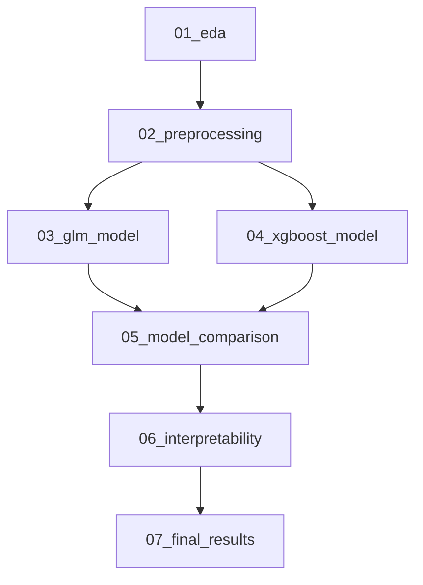

# GLM vs XGBoost Pipeline Execution Guide

This guide shows how to run your comprehensive modeling pipeline using the master pipeline runner.

## **Current Status**

Based on the latest check:
- **Data Preprocessing**: COMPLETED
- **GLM Model Development**: COMPLETED (Best model: Best_Weighted_LR, AUC: 0.7673)
- **Next**: XGBoost Model Development

## **Quick Start - Next Steps**

Since GLM is complete, run XGBoost next:

```bash
# Run XGBoost phase
python run_pipeline.py --phase xgboost

# Or run complete remaining pipeline
python run_pipeline.py --all
```

## **Pipeline Execution**

### **Master Pipeline Runner**

```bash
# Check current status
python run_pipeline.py --status

# Run complete pipeline
python run_pipeline.py --all

# Run specific phases
python run_pipeline.py --phase eda
python run_pipeline.py --phase preprocessing
python run_pipeline.py --phase glm
python run_pipeline.py --phase xgboost
python run_pipeline.py --phase compare
python run_pipeline.py --phase interpret
python run_pipeline.py --phase document

# Force re-run completed phases
python run_pipeline.py --phase glm --force
```

### **Direct Script Execution (Alternative)**

```bash
# Run scripts directly with uv
uv run python 01_eda/quick_eda.py
uv run python 02_preprocessing/data_preprocessing.py
uv run python 03_glm_model/glm_modeling.py
uv run python 04_xgboost_model/xgboost_modeling.py
uv run python 05_model_comparison/compare_models.py
uv run python 06_interpretability/local_interpretability.py
uv run python 07_final_results/final_documentation.py
```

## **Pipeline Architecture**



**Phase Dependencies:**
- `eda`: No dependencies
- `preprocessing`: No dependencies
- `glm`: Requires preprocessing
- `xgboost`: Requires preprocessing
- `compare`: Requires both glm AND xgboost
- `interpret`: Requires compare
- `document`: Requires interpret

## ⚡ **Recommended Execution Sequence**

Since GLM is already completed, here's your next sequence:

### **Step 1: Run XGBoost** (15-20 minutes)
```bash
python run_pipeline.py --phase xgboost
```

### **Step 2: Compare Models** (5 minutes)
```bash
python run_pipeline.py --phase compare
```

### **Step 3: Interpretability Analysis** (10 minutes)
```bash
python run_pipeline.py --phase interpret
```

### **Step 4: Generate Documentation** (2 minutes)
```bash
python run_pipeline.py --phase document
```

### **Alternative: Run All Remaining**
```bash
# This will run xgboost → compare → interpret → document
python run_pipeline.py --all
```

## **Expected Outputs**

After completion, you'll have:

```
glm_xgboost/
├── 01_eda/plots/                          # EDA visualizations
├── 02_preprocessing/processed_data/       # Processed datasets
├── 03_glm_model/results/                 # GLM models & results
├── 04_xgboost_model/results/             # XGBoost models & results
├── 05_model_comparison/results/          # Model comparison & winner
├── 06_interpretability/results/          # LIME explanations
└── 07_final_results/                     # Final documentation
    ├── executive_summary.txt
    ├── technical_documentation.txt
    ├── modeling_guidelines_compliance.txt
    └── project_summary.txt
```

## 🔧 **Troubleshooting**

### **Common Issues:**

1. **"Dependencies not met"**
   - Check status: `python run_pipeline.py --status`
   - Run missing dependencies first

2. **"Script not found"**
   - Ensure you're in the project root directory
   - Check file exists: `ls -la 04_xgboost_model/xgboost_modeling.py`

3. **"uv command not found"**
   - Install uv: `pip install uv`
   - Or run directly: `python -m uv run python script.py`

4. **Long execution times**
   - XGBoost: 15-20 minutes (hyperparameter optimization)
   - GLM: 10-15 minutes (cross-validation)
   - Others: < 10 minutes each

### **Performance Tips:**

- **For Development**: Run individual phases for faster iteration
- **For Production**: Use `--all` for complete validation
- **For Re-runs**: Use `--force` to override completion checks

## **Key Features**

**Dependency Checking**: Won't run a phase without prerequisites
**Status Tracking**: Shows what's completed vs pending
**Error Handling**: Stops pipeline on failures
**Timing**: Reports execution duration
**Force Re-run**: Override completion checks
**Real-time Output**: See progress during execution

## **Current GLM Results**

Your completed GLM analysis shows:
- **Best Model**: Best_Weighted_LR (Ridge regularization with class weights)
- **Test Performance**:
  - AUC: 0.7594
  - Accuracy: 0.686
  - F1-Score: 0.596
- **Top Features**: V13_squared, feature_std, V13_V7_interaction

Now ready for XGBoost comparison!

## **Pro Tips**

1. **Check Status First**: Always run `--status` to see current progress
2. **Use the Right Method**: Python runner for development, bash for automation
3. **Monitor Resources**: XGBoost tuning is CPU-intensive
4. **Save Intermediate Results**: Each phase saves outputs for recovery
5. **Follow the Guidelines**: Pipeline ensures compliance with modeling governance

## 📞 **Support**

If you encounter issues:
1. Check the status: `python run_pipeline.py --status`
2. Review the error messages in the output
3. Ensure all dependencies are met
4. Try running individual phases to isolate issues

Happy modeling!